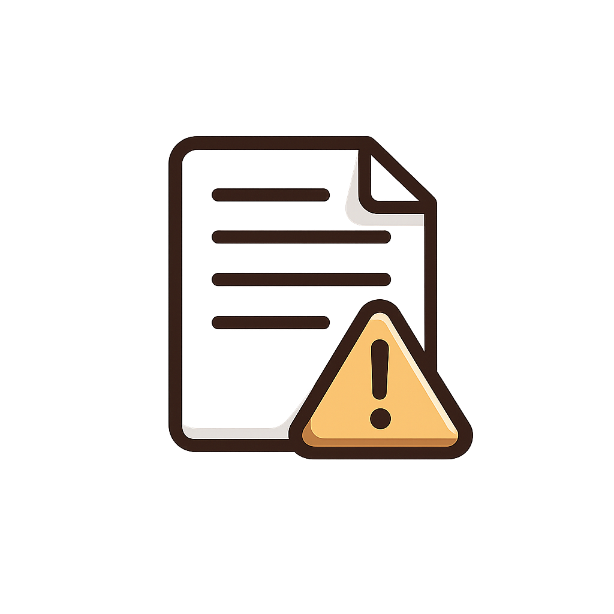
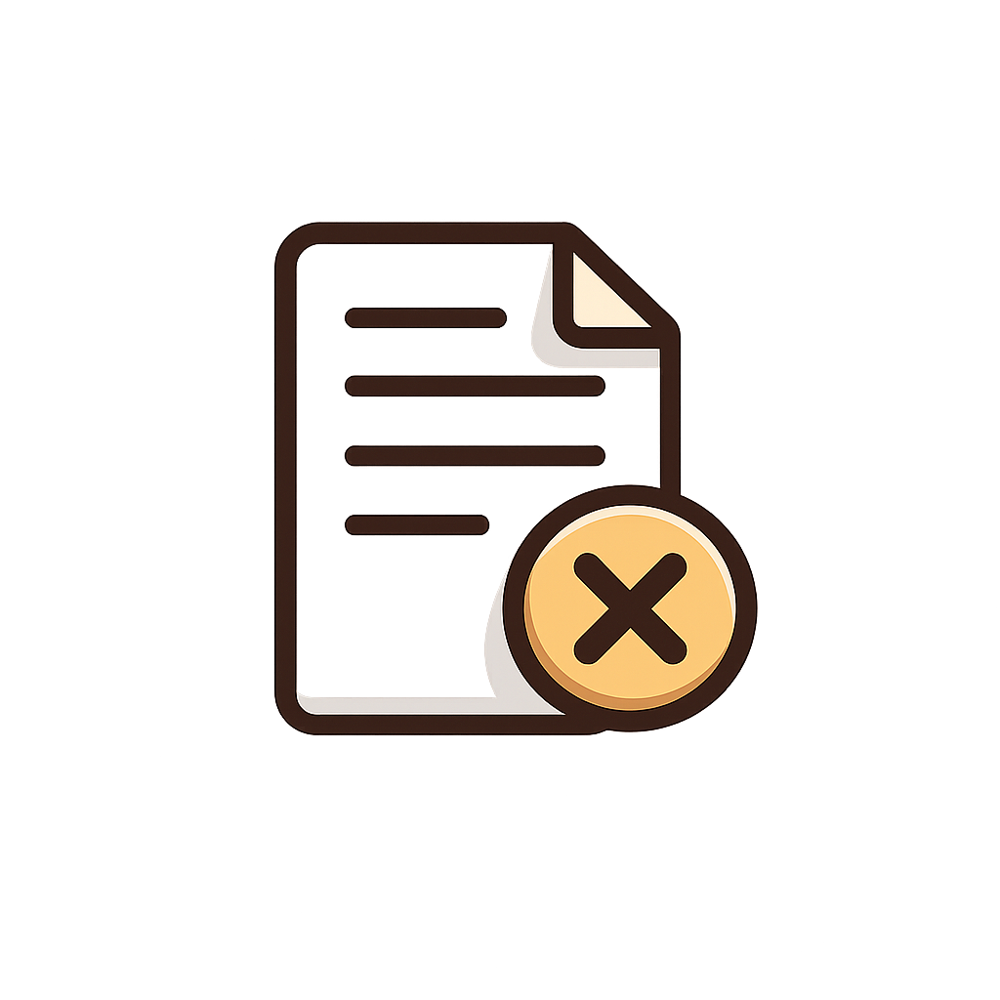
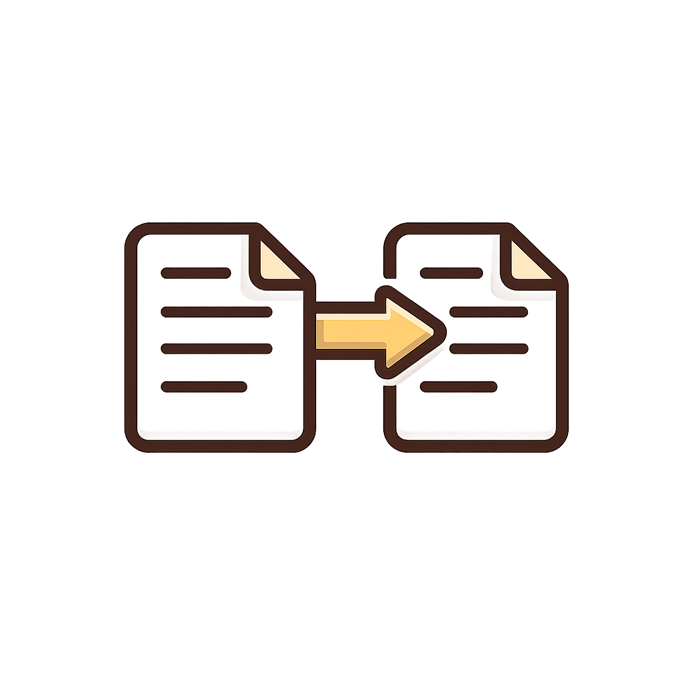
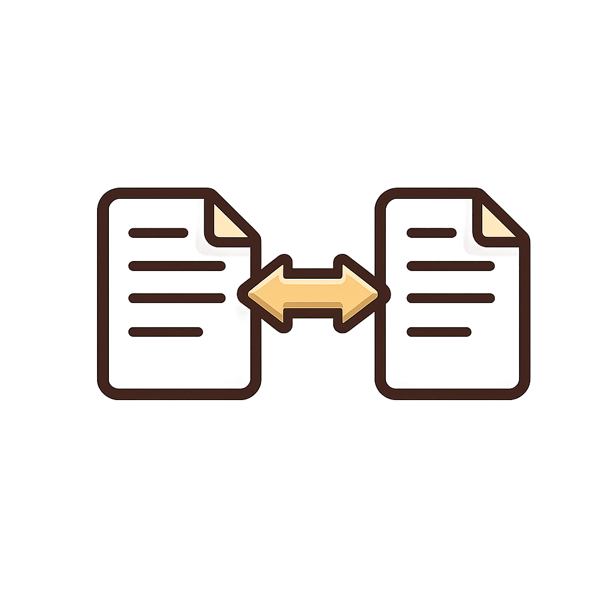
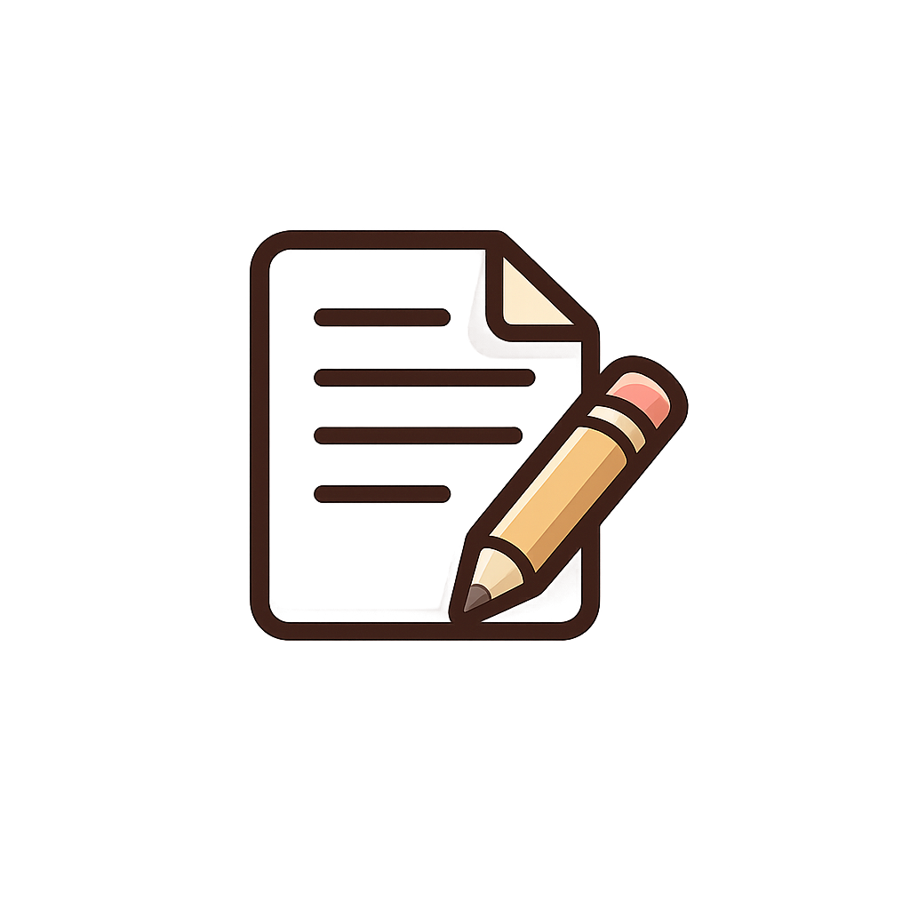
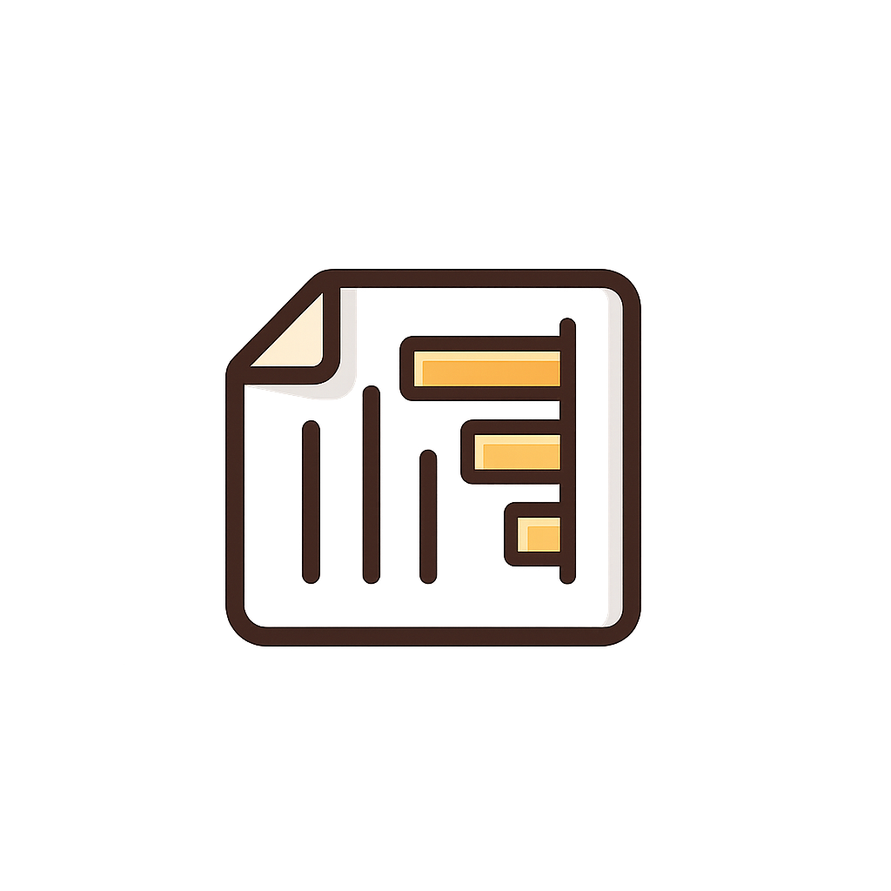
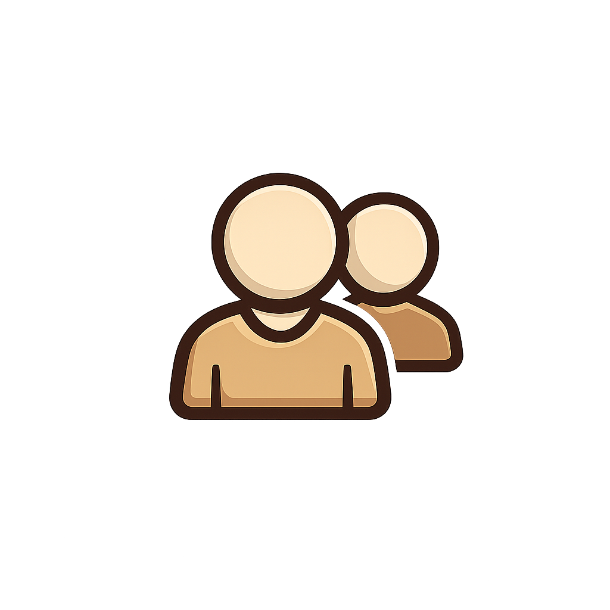

# Manual de uso del Sistema Académico USO

Este manual explica cómo usar el sistema para crear, modificar, imprimir y consultar reportes académicos administrativos.

## Señales del manual

| Señal | Significado |
| --- | --- |
| [RUTA] | Indica la opción o pantalla que debe abrirse. |
| [CLIC] | Indica el botón que debe presionarse. |
| [IMPORTANTE] | Dato obligatorio o validación que debe revisarse antes de guardar. |
| [RESULTADO] | Acción esperada después de completar un paso. |
| [ERROR] | Situación que debe corregirse antes de continuar. |

## 1. Acceso al sistema

[RUTA] Abra el sistema desde el navegador en la dirección configurada para el frontend.

1. Ingrese con el usuario asignado por el administrador.
2. Escriba la contraseña correspondiente.
3. Presione [CLIC] `Iniciar sesión`.

[RESULTADO] El sistema mostrará el menú principal con los módulos disponibles según el rol del usuario.

[IMPORTANTE] Si el sistema no permite ingresar, revise que el backend esté ejecutándose y que el usuario tenga un rol autorizado.

## 2. Menú principal

Después de iniciar sesión, la barra superior permite navegar entre los módulos principales:

- Penalidad
- Retiro de ciclo
- Equivalencias
- Absorciones
- Anotaciones
- Consultas
- Informes
- Usuarios, disponible para administración

[SEÑAL] Cada módulo tiene botones de acción como `Crear`, `Modificar` e `Imprimir`.

## 3. Flujo general de trabajo

La mayoría de módulos siguen el mismo patrón:

1. [RUTA] Abra el módulo correspondiente.
2. [CLIC] Presione `Crear` para registrar un nuevo documento.
3. Complete los datos del estudiante, carrera, ciclo, materia y autoridades.
4. Revise los campos obligatorios.
5. [CLIC] Presione `Guardar`.
6. [RESULTADO] El sistema registra el documento y permite imprimirlo.

Para modificar:

1. [RUTA] Abra el módulo.
2. [CLIC] Presione `Modificar`.
3. Busque el registro por correlativo, estudiante, carrera, fecha o estado.
4. [CLIC] Seleccione el registro.
5. Edite los campos necesarios.
6. [CLIC] Presione `Guardar cambios`.

Para imprimir:

1. [RUTA] Abra el módulo.
2. [CLIC] Presione `Imprimir`.
3. Seleccione el documento.
4. [CLIC] Presione el botón de impresión.

## 4. Penalidad

[RUTA] `Penalidad`

Use este módulo para gestionar documentos de penalidad académica.

Acciones disponibles:

- `Crear penalidad`: registra una nueva penalidad.
- `Modificar`: permite buscar y editar penalidades registradas.
- `Imprimir`: genera la vista de impresión del documento.

[IMPORTANTE] Revise que las materias, UV, ciclo y datos del alumno estén correctos antes de guardar.

## 5. Retiro de ciclo

[RUTA] `Retiro de ciclo`

Use este módulo para crear solicitudes de retiro de asignaturas o ciclo.

Acciones disponibles:

- `Crear retiro`
- `Modificar`
- `Imprimir retiro`

[IMPORTANTE] El ciclo debe seleccionarse correctamente: `I`, `II` o `INTERCICLO`, junto con el año académico.

[SEÑAL] En materias, el campo de UV se calcula con base en las horas académicas registradas.

## 6. Equivalencias

[RUTA] `Equivalencias`

Use este módulo para registrar equivalencias entre materias cursadas y materias solicitadas.

Flujo recomendado:

1. Registre los datos del estudiante.
2. Seleccione carrera o plan correspondiente.
3. Agregue las materias cursadas y solicitadas.
4. Revise notas, UV y observaciones.
5. Guarde el documento.

[IMPORTANTE] En equivalencias, cada fila debe corresponder a una relación clara entre asignatura cursada y asignatura solicitada.

## 7. Absorciones

[RUTA] `Absorciones`

Use este módulo para dictámenes de absorción de asignaturas.

El formulario permite registrar:

- Asignaturas absorbidas.
- Asignaturas no existentes en el plan solicitado.
- Asignaturas cursadas, reprobadas y absorbidas.

[IMPORTANTE] Verifique que el plan de origen y el plan solicitado sean correctos antes de imprimir.

## 8. Anotaciones

[RUTA] `Anotaciones`

Use este módulo para registrar anotaciones relacionadas con docentes, asignaturas, facultad y observaciones.

Acciones disponibles:

- Crear anotación.
- Modificar anotación.
- Imprimir anotación.

[IMPORTANTE] Revise la fecha, asignatura/grupo y observador antes de guardar.

## 9. Consultas

[RUTA] `Consultas`

Use este módulo para registrar consultas de estudiantes.

Acciones disponibles:

- Crear consulta.
- Modificar consulta.
- Imprimir consulta.

[SEÑAL] El buscador permite localizar registros por datos visibles en la tabla.

## 10. Informes y reportes

[RUTA] `Informes`

Al entrar al módulo se muestran dos opciones:

- `Reportes`
- `Histórico reportes`

### 10.1 Reportes

[CLIC] Presione `Reportes`.

Esta pantalla muestra un dashboard con filtros y gráficos:

- Año
- Ciclo
- Materia
- Tipo de reporte
- Coordinador

Gráficos disponibles:

- Reportes por tipo.
- Reportes por mes.
- Reportes por ciclo.
- Materias con más registros.
- Reportes por coordinador.
- Reportes por estado.
- Barras verticales por mes, año o ciclo.

[IMPORTANTE] Después de cambiar filtros, presione [CLIC] `Filtrar`.

[RESULTADO] Los indicadores, gráficos y tabla se actualizan con los filtros aplicados.

### 10.2 Histórico reportes

[CLIC] Presione `Histórico reportes`.

Esta pantalla muestra la tabla de reportes registrados. Incluye:

- Fecha.
- Tipo.
- Correlativo.
- Alumno o referencia.
- Carrera o facultad.
- Ciclo.
- Materia.
- Coordinador.
- Estado.

[SEÑAL] Use el buscador para localizar registros por coordinador, tipo, materia, ciclo o alumno.

### 10.3 Imprimir reporte PDF

1. Abra `Informes`.
2. Entre a `Reportes` o `Histórico reportes`.
3. Aplique filtros si es necesario.
4. [CLIC] Presione `Imprimir reporte PDF`.

[RESULTADO] El sistema abre o descarga un PDF actualizado con los gráficos y la tabla de reportes.

## 11. Usuarios

[RUTA] `Usuarios`

Disponible para usuarios con rol administrativo.

Permite:

- Crear usuarios.
- Asignar roles.
- Activar o inactivar accesos.
- Administrar permisos de uso del sistema.

[IMPORTANTE] Asigne el rol correcto según las funciones que realizará cada usuario.

## 12. Ciclo académico y año

En los formularios donde aparece ciclo académico, el sistema debe registrar dos datos:

- Ciclo: `I`, `II` o `INTERCICLO`.
- Año: año académico correspondiente.

[RESULTADO] El sistema guarda el ciclo de forma ordenada para que los reportes puedan filtrar correctamente.

## 13. Unidades valorativas

En los apartados donde se capturan horas académicas y UV:

- Ingrese las horas académicas.
- El sistema calcula las unidades valorativas.
- Revise el resultado antes de guardar.

[IMPORTANTE] Si las horas académicas están vacías o incorrectas, las UV también pueden quedar incorrectas.

## 14. Estados y búsquedas

Los documentos pueden aparecer con estados como creado, impreso, actualizado u otros definidos por el sistema.

[SEÑAL] Use los filtros y buscadores para revisar únicamente los registros necesarios.

[ERROR] Si no aparecen datos, revise:

- Que los filtros no estén demasiado restringidos.
- Que el año y ciclo sean correctos.
- Que existan registros creados para ese módulo.
- Que el usuario tenga permisos para consultar el módulo.

## 15. Recomendaciones de uso

- Revise todos los campos antes de guardar.
- Use nombres completos y sin abreviaturas innecesarias.
- Mantenga coherencia en nombres de materias.
- Use tildes y ñ correctamente.
- Antes de imprimir, confirme que el correlativo y la fecha sean correctos.
- En reportes, limpie filtros si necesita ver todos los registros.

## 16. Soporte rápido

| Problema | Acción recomendada |
| --- | --- |
| No puedo iniciar sesión | Verifique usuario, contraseña y conexión con el backend. |
| No aparecen registros | Limpie filtros o revise permisos del usuario. |
| El PDF no abre | Permita ventanas emergentes o revise que el backend esté activo. |
| Los gráficos no cambian | Presione `Filtrar` después de seleccionar opciones. |
| Un dato aparece incorrecto | Vaya a `Modificar`, busque el registro y actualícelo. |
